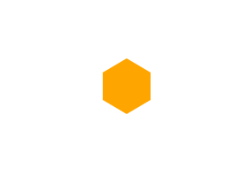
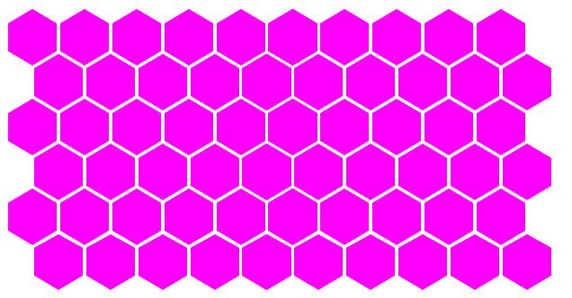

# Hexagon Components
## Hexagon(육각형 도형)
### Example
``` Javascript
import Hexagon from './Hexagon';
...
<Hexagon length="25" color="blue />
```
### Definition and Usage
    The <Hexagon> component defines a hexagon figure.    
    The <Hexagon> is strictly matched with its shape, so you can customize it easily
### Attributes
|  Attribute  |         Value        |  Default | Description
|:------------|:--------------------:|----------|:-------------|
|    length   |   Positive Integer   | 30       | The length of one side of hexagon |
|    margin   |   Positive Integer   | 3        | Right margin of hexagon |
|    color    | color \| transparent | red      | background-color of hexagon<br>**No border in this tag!**
| orientation |    tiptoe \| foot    | "tiptoe" | **tiptoe** : hexagon, a vertex is the most bottom element<br>&nbsp;**foot** &nbsp; : hexagon, a side is the most bottom element
### Sample Image


--------------------------------------------------------------------------------------------

## HexagonTable(육각형 타일)
### Example
``` Javascript
import HexagonTable from './HexagonTable';
...
<HexagonTable row="8" col="10" length="25" color="blue />
```
### Definition and Usage
    The <HexagonTable> component defines a hexagon pattern tiles.    
    The <HexagonTable> is also strictly matched with its shape.
### Attributes
|  Attribute  |          Value       | Default | Description
|-------------|----------------------|---------|--------------|
|     row     |   Positive Integer   | 3       | number of rows
|     col     |   Positive Integer   | 3       | number of cols
|    length   |   Positive Integer   | 30      | The length of one side of hexagon |
|    margin   |   Positive Integer   | red     | Right margin of hexagon |
|    color    | color \| transparent | tiptoe  | background-color of hexagon<br>**No border in this tag!**
| orientation |    tiptoe \| foot    |
### Sample Image

